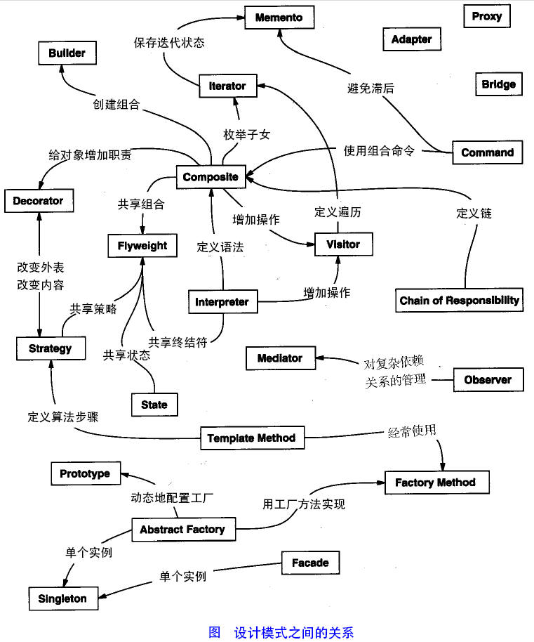

# 设计模式

设计模式一套被*反复使用的*、*多数人知晓的*、*经过分类编目的*、*代码设计经验的*总结。使用设计模式的目的是**为了重用代码、让代码更容易被理解、保证代码可靠性**。项目中合理地运用设计模式可以完美解决很多问题，每种模式在现实中都有相应的原理来与之对应。每种设计模式都描述了一个在我们周围不断重复发生的问题，以及该问题的核心解决方案，这也是设计模式能被广泛应用的原因。

> 设计模式代表了最佳实践，通常被有经验的<del>面向对象的</del>开发人员所采用的。设计模式是软件开发过程中面临的**一般问题**的解决方案。这些解决方案是众多软件开发人员经过相当长的时间的经验与错误总结出来的。

## 设计模式的历史

说起设计模式就不得不提GOF（四人帮）。1994年，Erich Gamma、Richard Helm、Ralph Johnson和John Vlissides合作，在《设计模式 - 可复用的面向对象软件元素》一书中首次提出了设计模式的概念。他们所提出的设计模式主要是基于以下的面向对象设计原则：

- 对*接口编程*而不是对实现编程。
- 优先*使用对象组合*而不是继承。

## 设计模式的类型

根据设计模式的参考书《设计模式 - 可复用的面向对象软件元素》的介绍与归纳，我们可以将设计模式分为三大类：**创建型设计模式**、**结构型设计模式**和**行为型设计模式**。

### 创造型设计模式

这些设计模式提供了一种在创建对象的同事隐藏创建逻辑的方式，而不是使用new运算符直接实例化对象。这使得程序在判断针对某个给定实例需要哪些对象时更加灵活。

> 常见的创造型设计模式有**工厂模式**、**抽象工厂模式**、**单例模式**、**建造者模式**、**原型模式**。

### 结构型设计模式

这些设计模式关注类和对象的组合。继承的概念被用来组合接口和定义组合对象获得新功能方式。

> 常见的结构性设计模式有**适配器模式**、**桥接模式**、**过滤器模式**、**组合模式**、**装饰器模式**、**外观模式**、**享元模式**、**代理模式**。

### 行为型设计模式

这些设计模式特别关注对象之间的通信。

> 常见的行为型设计模式有**责任链模式**、**命令模式**、**解释器模式**、**迭代器模式**、**中介者模式**、**备忘录模式**、**观察者模式**、**状态模式**、**空对象模式**、**策略模式**、**模板模式**、**访问者模式**。

随着时间的沉淀，在原来23种设计模式之后我们还发现了更多的设计模式在我们的开发中体现。

## 设计模式的六大原则

### 开闭原则

开闭原则的意思是：**对扩展开放，对修改关闭。**在程序需要进行拓展的时候，不能去修改原有的代码，实现一个热插拔的效果。简而言之，是为了使程序具有良好的扩展性，易于维护和升级。想要达到这样的效果，我们需要使用接口和抽象类。

### 里氏替换原则

里氏替换原则是面向对象设计的基本原则之一。里氏替换原则中说，任何鸡肋可以出现的地方，子类一定可以出现。LSP是继承复用的基石，只有当派生类可以替换掉基类，且软件单位的功能不受到影响时，基类才能真正被复用，而派生类也能够在基类的基础上增加新的行为。**里氏替换原则是对开闭原则的补充。**实现开闭原则的关键步骤就是抽象化，而基类与子类的继承关系就是抽象化的具体实现，所以里氏替换原则是对实现抽象化的具体步骤的规范。

### 依赖倒转原则

这个原则是开闭原则的基础，具体内容：针对接口编程，依赖于抽象而不依赖于具体。

### 接口隔离原则

这个原则的意思是：使用多个隔离的接口，比使用单个接口要好。它还有另一个意思是：降低类之间的耦合度。由此可见，其实设计模式就是从大型软件架构触发、便于升级和维护的软件设计思想，它强调降低依赖，降低耦合。

### 迪米特法则（最少知道原则）

最少知道原则是指：一个实体应当尽量少的与其他实体之间发生相互作用，使得系统功能模块相对独立。

### 合成复用原则

合成服用原则是指：尽量使用合成/聚合的方式，而不是使用继承。

## 扩展

前端设计模式推荐网站

- [patterns](https://www.patterns.dev/)
